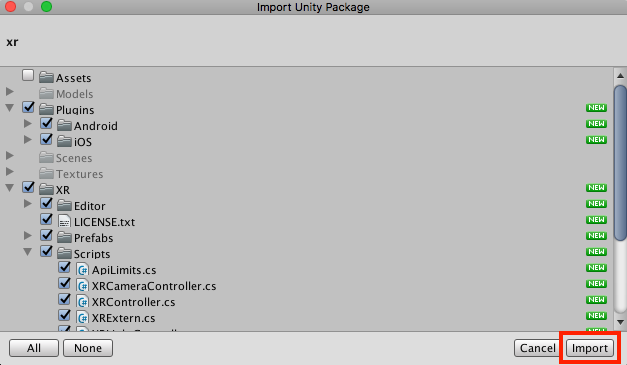
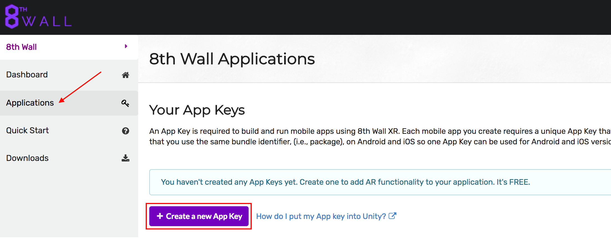
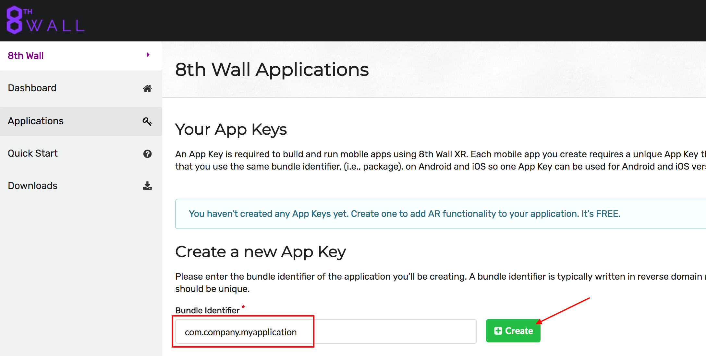
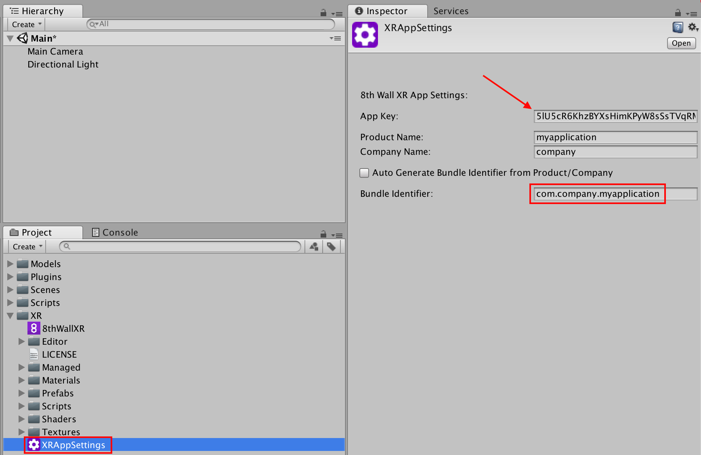
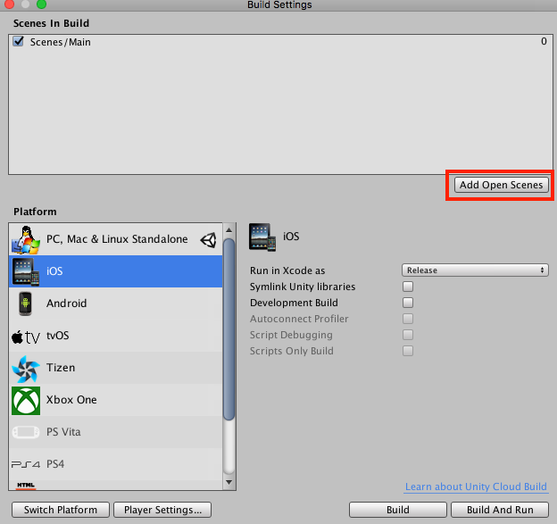
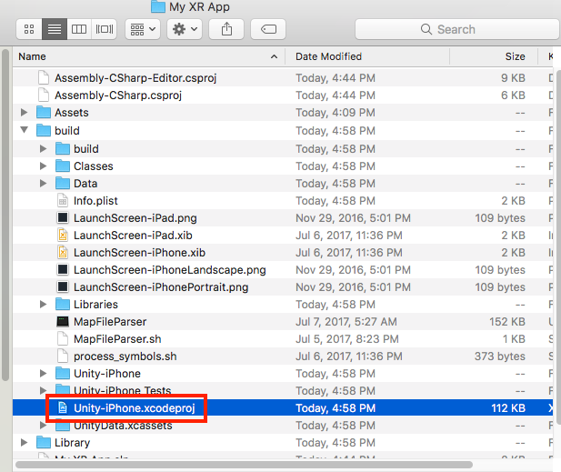
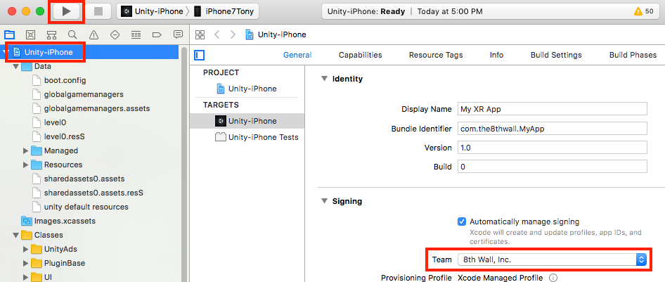

# 8th Wall XR Demo App

# Overview

This sample application contains a simple scene consisting of a TV sitting on a table. The scene comes preconfigured with all of the 8th Wall XR controller scripts
attached to the appropriate game objects.  Simply install 8th Wall XR and build!

If you want to learn how to setup the scene yourself, please take a look at the full [Tutorial](https://github.com/8thwall/xr-unity/tree/master/projects/8thWallXR-Tutorial)

The app shows how 8th Wall XR can:

* Control the position and rotation of the camera in the scene as you move your device in the real world by adding an **XRCameraController** to the camera.
* Capture camera input and use it as the **background** of the scene by adding an **XRVideoController** to the camera.
* Capture camera input and use it as a "live" texture on the TV Screen by adding an **XRVideoTextureController** to the TV Screen.
* Adjust the intensity of the scene light based on the lighting conditions in the world around you by adding an **XRLightController** to the light.
* Place the table onto a detected surface by adding an **XRSurfaceController** to the table.

**NOTE**: This project was created with Unity **2017.1.0f3**. If you are on an older version, it should still work, however the textures might not appear properly.

## Download Unity

If you don't already have Unity installed, please download it from <a href='https://www.unity3d.com' target='_blank'>www.unity3d.com</a>

Unity version **2017.1.0f3** or later is recommended. See note above.

Note: During installation, make sure you install **BOTH** Android & iOS build support packages, even if you only plan to develop for one:

* Android Build Support
* iOS Build Support

## Open Unity Project

Open Unity and on the welcome screen, click "Open".  Browse to this directory, which contains the project files (Assets/ & ProjectSettings/)

Open the scene by navigating to Assets / Scenes / Main and double clicking.

## Download 8th Wall XR for Unity

The 8th Wall XR Unity package is available here:

<a href='https://www.8thwall.com/#unity' target='_blank'>https://www.8thwall.com/#unity</a>

## Install XR

Add 8th Wall XR to your Unity project.  Locate the xr-<version>.unityplugin file you just downloaded and simply double-click on it.  A progress bar will appear as it's loaded.

Once finished, a window will display the contents of the XR package.  Leave all of the boxes checked and click "Import".

## Generate App Key

1. To create an app key, go to [https://console.8thwall.com](https://console.8thwall.com) and login. Select "Applications" from the left navigation and then click the **"+ Create a new App Key"** button:

2. Enter the bundle identifier of the application you’ll be creating, then click **"+ Create"**

**IMPORTANT**: The bundle identifier entered will here needs to be identical to the bundle identifier in your Unity project.

Note: A bundle identifier is typically written in [reverse domain name notation](https://en.wikipedia.org/wiki/Reverse_domain_name_notation#Examples) and identifies your application in the app store. It should be unique.

## Install App Key

1. Select "Applications" from the left navigation.
2. In the "Your App Keys" table, locate the row containing your App and its associated App Key. 
3. Click the "Copy" button.

4. In Unity, select **Assets / XR / XRAppSettings**.  Paste your key into the **App Key** field.

**IMPORTANT**: Make sure that the Bundle Identifier matches the bundle identifier you entered in Step #2.

## Build Application

Go to **File -> Build Settings** and click "Add Open Scenes".

In this example we will be building for iOS.  Click "Build" and in the pop up window give the build a name.  Click Save to have Unity generate the XCode project.

Once complete, a window will open up with the location of the code project.  Open it and double click "Unity-iPhone.xcodeproj" to open the XCode project.

Inside XCode, make sure to set Team, then click Play to compile, install and run the app on your phone!

