# 8th Wall XR Sample App

# Overview

This sample application contains a simple scene consisting of a TV sitting on a table.  With a few simple steps you will:

* Control the position and rotation of the camera in the scene as you move your device in the real world by adding an **XRCameraController** to the camera.
* Capture camera input and use it as the **background** of the scene by adding an **XRVideoController** to the camera.
* Capture camera input and use it as a "live" texture on the TV Screen by adding an **XRVideoTextureController** to the TV Screen.
* Adjust the intensity of the scene light based on the lighting conditions in the world around you by adding an **XRLightController** to the light.
* Place the table onto a detected surface by adding an **XRSurfaceController** to the table.

**NOTE**: This project was created with Unity **2017.1.0f3**. If you are on an older version, it should still work, however the textures might not appear properly.

## Download Unity

If you don't already have Unity installed, please download it from <a href='https://www.unity3d.com' target='_blank'>www.unity3d.com</a>

Unity version **2017.1.0f3** or later is recommended. See note above.

Note: During installation, make sure you install **BOTH** Android & iOS build support packages, even if you only plan to develop for one:

* Android Build Support
* iOS Build Support

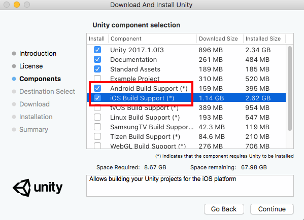

## Start a New Unity Project

Open Unity and on the welcome screen, click "New" to create a new project.  Give it a name and click "Create Project"

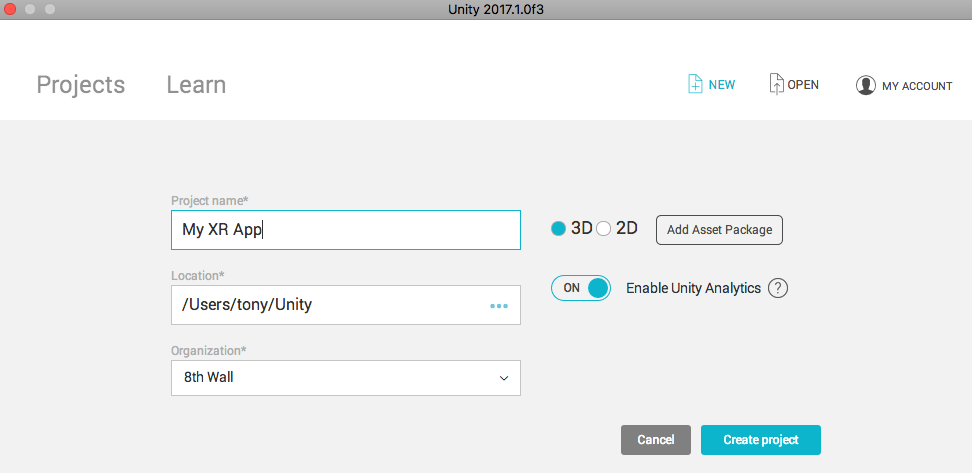

## Download the sample Unity app

[Download](https://github.com/8thwall/xr-unity/blob/master/projects/8thWallXR-Sample/8thWallXR-SampleApp.unitypackage?raw=true) the sample 8th Wall XR enabled Unity project

Double click on the .unitypackage file downloaded, and import all of the objects into the Unity project.  This sample application contains a simple scene (called "Main") consisting of a TV sitting on a table::

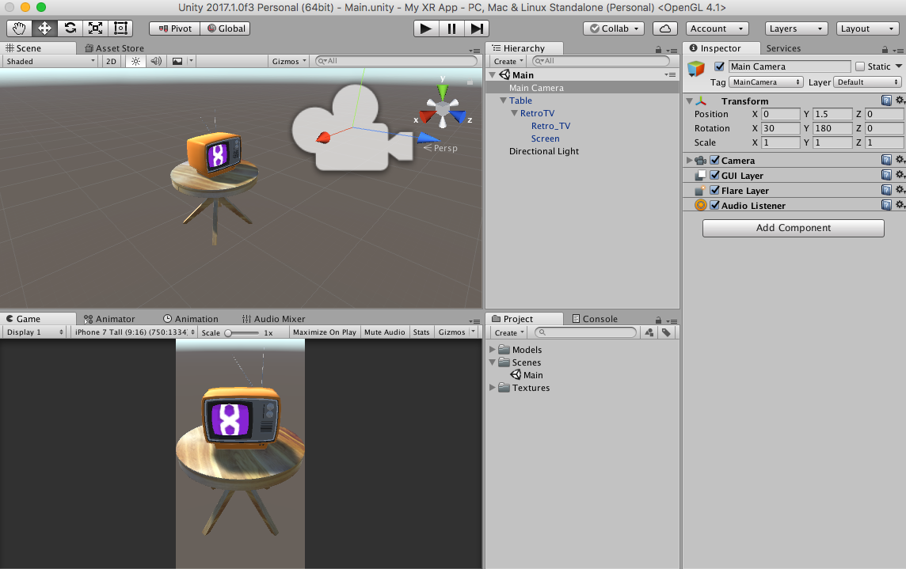

## Download 8th Wall XR for Unity

The 8th Wall XR Unity package is available here:

<a href='https://releases.8thwall.com/xr/unity/download/release' target='_blank'>https://releases.8thwall.com/xr/unity/download/release</a>

## Install XR

Add 8th Wall XR to your Unity project.  Locate the .unityplugin file you just downloaded and simply double-click on it.  A progress bar will appear as it's loaded.

Once finished, a window will display the contents of the XR package.  Leave all of the boxes checked and click "Import".

## Create an XRController

Create an XRController object in your scene. You can do this in the Hierarchy panel via Create -> XRController or GameObject menu -> XRController:

## XRCameraController

XRCameraController attaches to your Main Camera.  It's primary function is to control the position and rotation of the camera in your scene as you move your device in the real world.

Select the Camera in your scene and perform one of the following actions:

* Drag the XRCameraController.cs script (default location: Assets/XR/Scripts/XRCameraController.cs) onto to the inspector panel for your camera
* Click "Add Component" in the inspector panel and search for "XR Camera Controller"

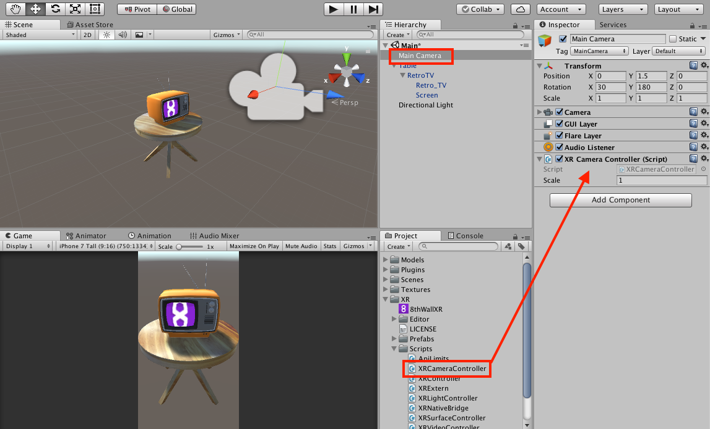

## XRVideoController

XRVideoController script also attaches to your camera.  It captures camera input and sets it as the background of your scene.

Select the Camera in your scene and perform one of the following actions:

* Drag the XRVideoController.cs script (default location: Assets/XR/Scripts/XRVideoController.cs) onto to the inspector panel for your camera
* Click the "Add Component" button in the inspector panel and search for "XR Video Controller"

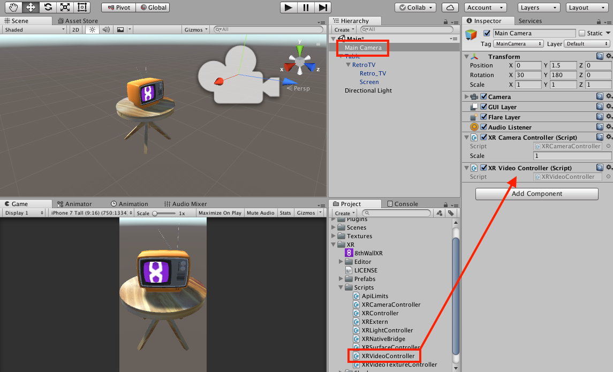

## XRLightController

XRLightController scipt attaches to the light in your scene.  It adjusts the intensity of your scene light based on the lighting conditions in the world around you.

Select the light in your scene and perform one of the following actions:

* Drag the XRLightController.cs script (default location: Assets/XR/Scripts/XRLightController.cs) onto to the inspector panel for your light
* Click the "Add Component" button in the inspector panel and search for "XR Light Controller"

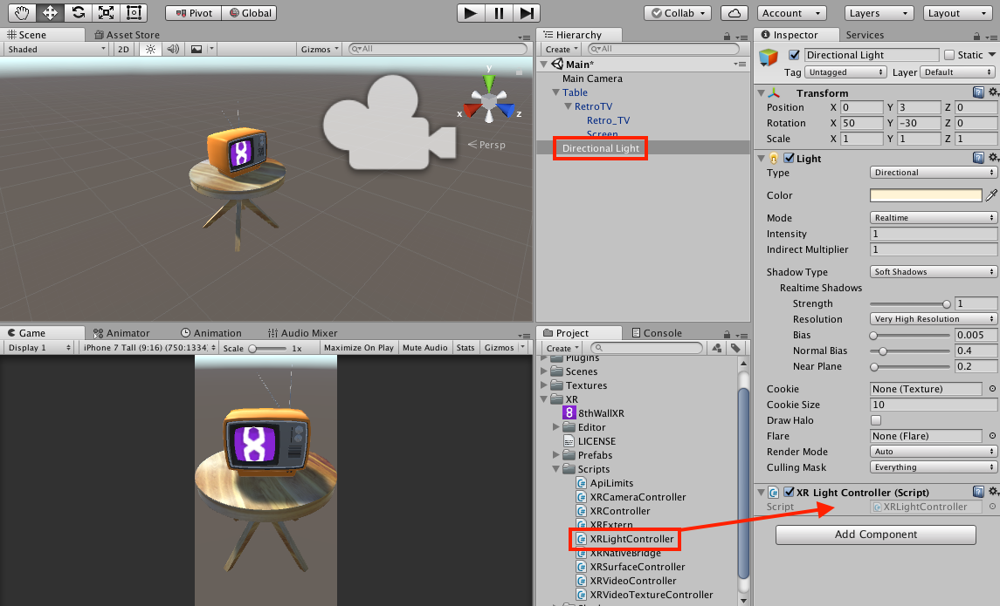

## XRSurfaceController

XRSurfaceController attaches to a game object in your scene.  In this example, attach it to the Table.  When XR detects a surface, the table will be placed on that surface.

Select the Table in your scene and perform one of the following actions:

* Drag the XRSurfaceController.cs script (default location: Assets/XR/Scripts/XRSurfaceController.cs) onto to the inspector panel for your camera
* Click "Add Component" in the inspector panel and search for "XR Surface Controller"

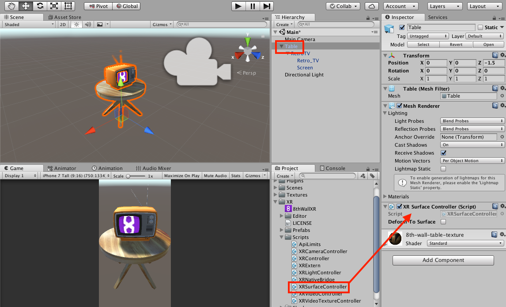

## XRVideoTextureController

XRVideoTextureController captures camera input and sets it as the main texture on a game object.  In this sample application, use it to display the what the camera captures on the TV screen.

Select the "Screen" object in your scene and perform one of the following actions:

* Drag the XRVideoTextureController.cs script (default location: Assets/XR/Scripts/XRVideoTextureController.cs) onto to the inspector panel for your camera
* Click the "Add Component" button in the inspector panel and search for "XR Video Texture Controller"

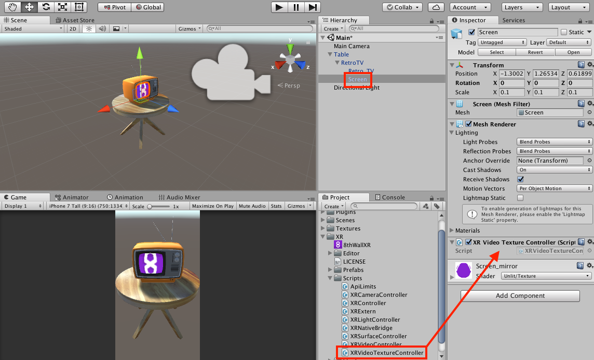

## Adjust Player Settings

Before you build the app, make sure to set a few things:

### Company Name and Product Name

Go to **Edit -> Project Settings -> Player**.  Enter in values for Company Name and Product Name

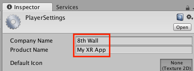

Below, for all 3 tabs, enter in a Bundle Identifier:

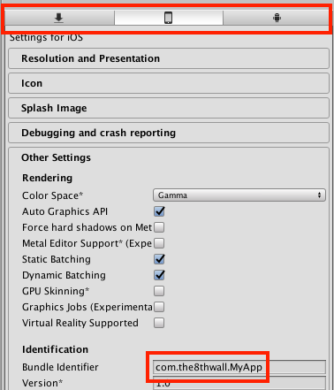

## Adjust Player Settings

Go to **File -> Build Settings** and click "Add Open Scenes".

## Build Application

In this example we will be building for iOS.  Click "Build" and in the pop up window give the build a name.  Click Save to have Unity generate the XCode project.

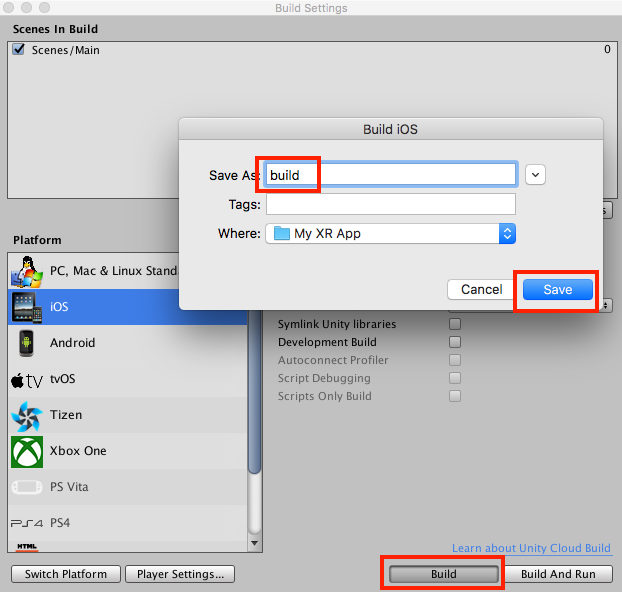

Once complete, a window will open up with the location of the code project.  Open it and double click "Unity-iPhone.xcodeproj" to open the XCode project.

Inside XCode, make sure to set Team, then click Play to compile, install and run the app on your phone!

