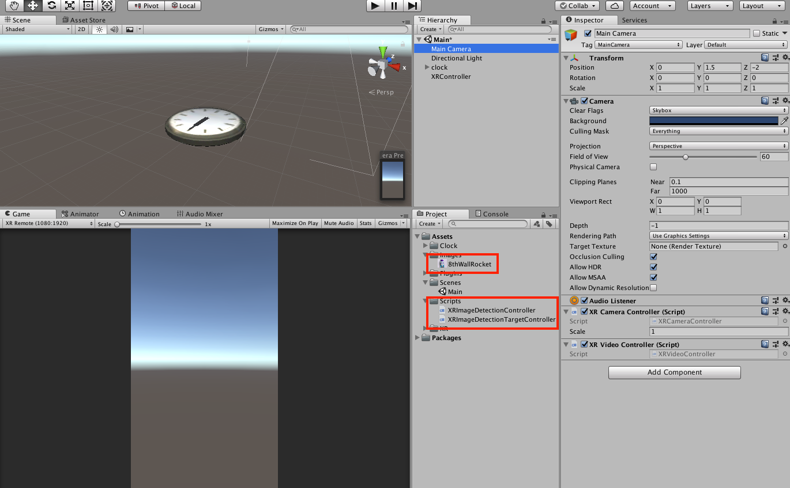
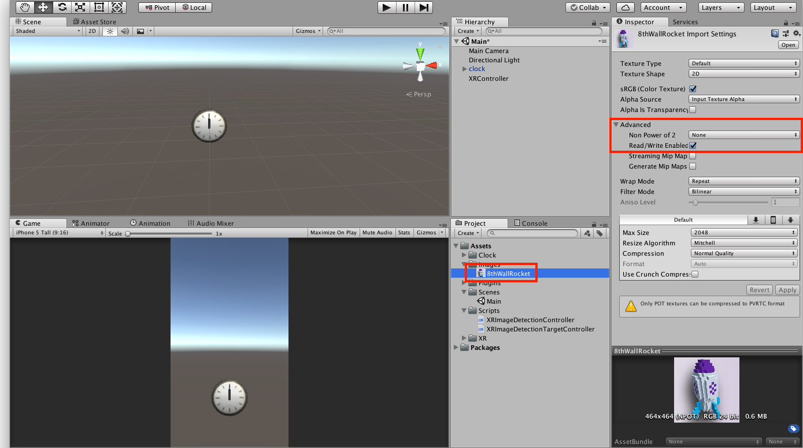
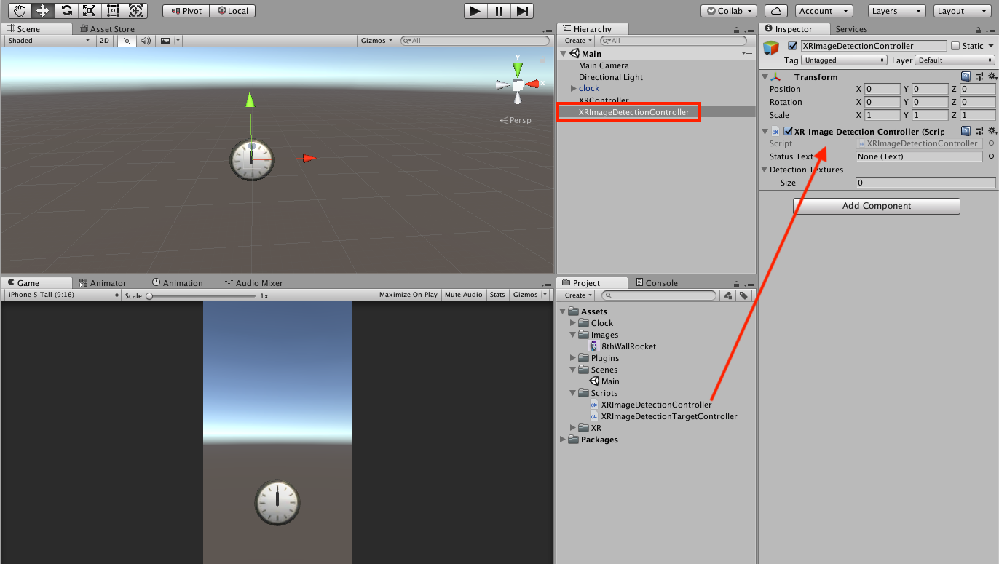
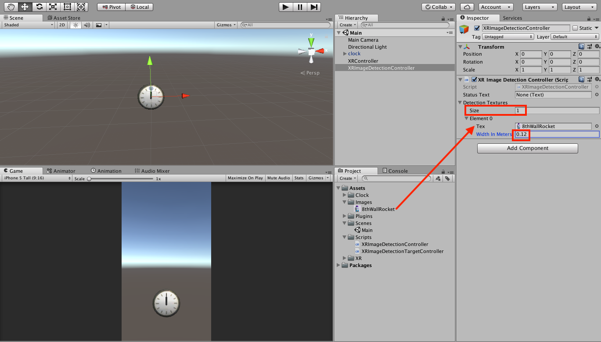
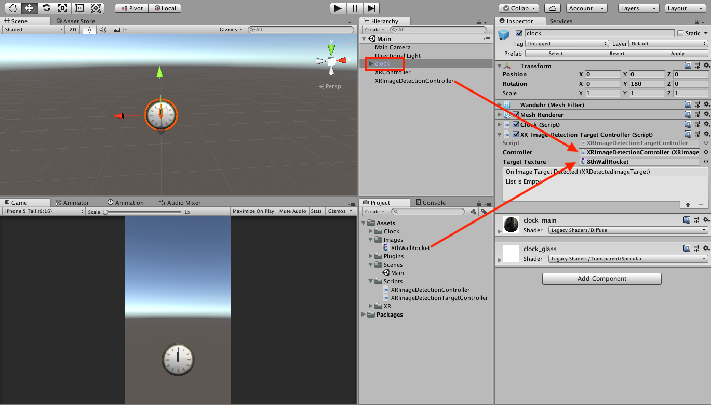
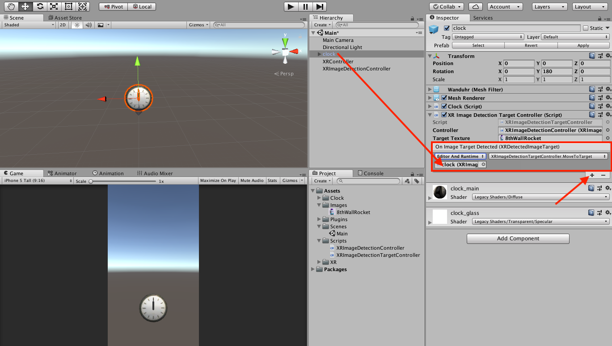

# Scripts

* [DragAlongSurface.cs](https://github.com/8thwall/xr-unity/tree/master/scripts/DragAlongSurface.cs) - Tap on an object and drag to move it along a surface
* [MeshVisualizer.cs](https://github.com/8thwall/xr-unity/blob/master/scripts/MeshVisualizer.cs) - Displays the mesh of an object.  Attach to the same object that has an XRSurfaceController, and enable "Deform To Surface" to visualize the shape of the detected surface"
* [PlaceObject.cs](https://github.com/8thwall/xr-unity/tree/master/scripts/PlaceObject.cs) - Tap to place an object in your scene.  If tap hits a surface, object will be placed on surface.  If not, it will be placed at touch point at a specified distance in front of the camera.
* [SunlightController.cs](https://github.com/8thwall/xr-unity/tree/master/scripts/SunlightController.cs) - A script that controls the rotation of a Directional Light in your scene based on the position of the sun. Makes AR shadows look more realistic by aligning their direction with real world shadows outside.
* [SurfaceVisualizer.cs](https://github.com/8thwall/xr-unity/blob/master/scripts/SurfaceVisualizer.cs) - Script that will visualize all detected surfaces and display information about the number/type of surfaces.  Can assign different materials for horizontal vs vertical surfaces.  Use with SurfaceOcclusion.mat & SurfaceOcclusion.shader to occlude game objects that are behind detected surfaces.
* [WorldPointsRenderer.cs](https://github.com/8thwall/xr-unity/tree/master/scripts/WorldPointsRenderer.cs) - Visualize detected WorldPoints in your scene. Attach to any game object.
* [XRImageDetectionController.cs](https://github.com/8thwall/xr-unity/blob/master/scripts/XRImageDetectionController.cs) - Script that makes it easy to define a set of image targets to detect.
* [XRImageDetectionTargetController.cs](https://github.com/8thwall/xr-unity/blob/master/scripts/XRImageDetectionTargetController.cs) - Attach this to the game object you want to be anchored/triggered when a tracked image it detected.

# XRImageDetectionController Example

This example simply moves a specified game object to the location of the detected image, but could be customized to achieve different behavior.

In this example, we will use an image of a rocket on 8th Wall's website to trigger placement of a clock game object.

This example assumes you have already:

* Added 8th Wall XR for Unity to your project, and configured an App Key.
* Added an XRController to your scene
* Attached XRCameraController and XRVideoController to your Main Camera

Download <a href="https://github.com/8thwall/xr-unity/blob/master/scripts/XRImageDetectionController.cs" target="_blank">XRImageDetectionController.cs</a> and <a href="https://github.com/8thwall/xr-unity/blob/master/scripts/XRImageDetectionTargetController.cs" target="_blank">XRImageDetectionTargetController.cs</a> and add them to your Unity project:

An <a href="https://github.com/8thwall/xr-unity/blob/master/images/8thWallRocket.png" target="_blank">image of the 8th Wall rocket</a> also exists in the GitHub repo under images/. Download and add the image to your Unity project.  This makes it easy to test image detection by simply pointing your camera at our website: <a href="https://www.8thwall.com" target=_blank>www.8thwall.com</a>

For each image you wish to detect, make sure the target texture has the following properties set:

* Advanced -> Non Power of 2 : **None**
* Advanced -> Read/Write Enabled : **Checked**

Create an empty game object called "XRImageDetectionController" and attach XRImageDetectionController.cs:

Configure Detection Textures:
* Set "Size" to the number of different images to detect
* For each image:
  * Set the texture
  * Define the expected real world width of the image, in Meters

Attach XRImageDetectionTargetController.cs to the game object you wish to "anchor" to the image target

* Drag XRImageDetectionController game object into the "Controller" field
* Drag the image that should trigger this game object in the "Target Texture" field

* Under "On Image Target Detected", click the "+" to add an OnImageTargetDetected event
* Associate the clock game object with this event
* Select the MoveToTarget() function

**Result**

Video:

https://www.youtube.com/watch?v=EvFisEJEHsY
